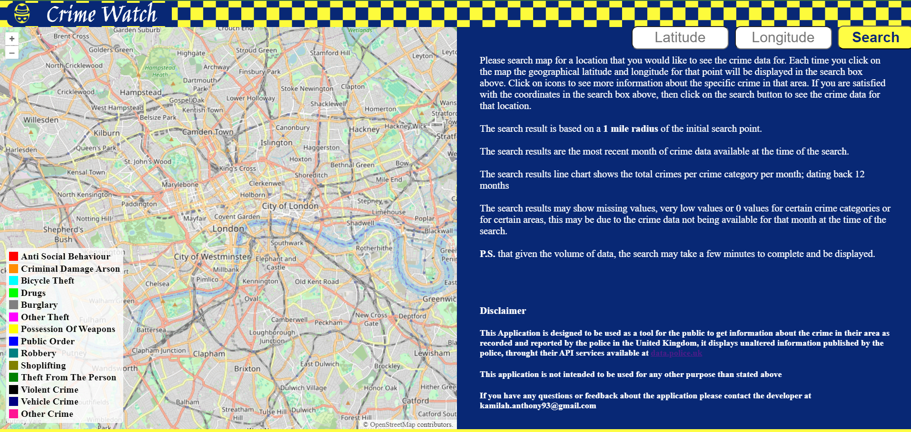

# CrimeWatch
This file serves as the main documentation for the CrimeWatch project. It provides an overview of the project, its purpose, and instructions on how to use it.

**Author:** [Rodwell]
**Version:** 1.0
**Date:** [20/04/2024]

## Table of Contents
- [Overview](#overview)
- [Installation](#installation)
- [Usage](#usage)
- [Tech Stack](#tech-stack)
- [App Preview](#app-preview)
- [Contributing](#contributing)

## Overview
CrimeWatch is a web application that allows users to view crime data for specific locations. It uses the UK Police API to fetch crime reports and displays them on an interactive map.

## Installation and Usage
To install the dependencies for this project, follow these steps:
1. Clone the project repository from GitHub.
##### Using Docker Containers - Recommended
1. Ensure Docker is installed on your system. If not, download and install Docker from [Docker's official site](https://www.docker.com/products/docker-desktop)

2. using the terminal cd to the CrimeWatch directory,by running the command:
```cd CrimeWatch```
4. Makesure to login to Docker, by running the command:
```docker login```

5. build containers using docker compose, by running the command:
```docker-compose build```

6. Start the containers using Docker Compose,by running the command:
``` docker-compose up```

7. Access the Application, Once the containers are running, open a web browser and navigate to http://127.0.0.1:8000 to access the CrimeWatch application.You should now be able to interact with the application and view crime data as intended.

8. Shut Down the Application, When you are done, you can stop the Docker containers by running the command:
```docker-compose down```

These steps should get the CrimeWatch Demo application running on your local machine using Docker, ensuring that all dependencies are correctly handled by the containerized environment.

## Tech Stack
- CSS3
- React
- Redux-Toolkit
- Django
- Django REST Framework
- OpenLayers
- Chart.js
- Docker
- Heroku 

## App Preview (screenshots)
### Landing Page


### Crime Map


## Contributing
If you would like to contribute to the CrimeWatch project, please follow these guidelines:

1. Fork the repository on GitHub.
2. Create a new branch with a descriptive name.
3. Make your changes and commit them to your branch.
4. Push your branch to your forked repository.
5. Submit a pull request to the main repository.
